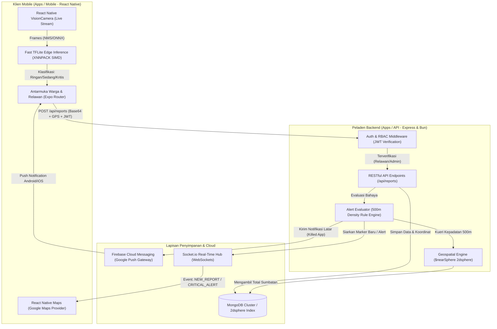
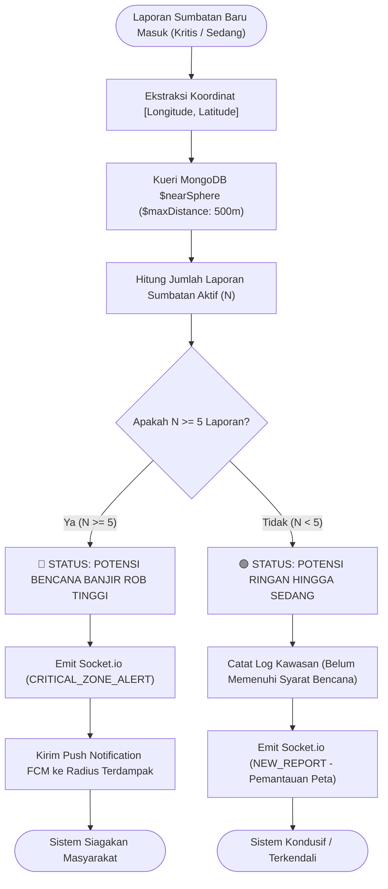
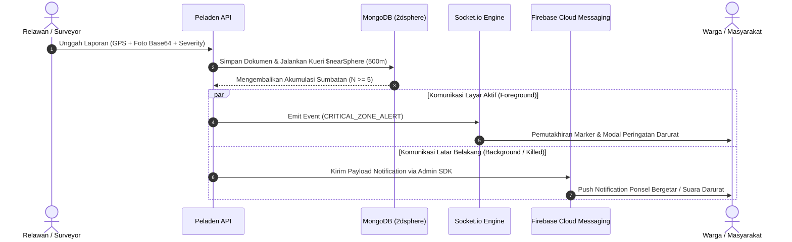

<div align="center">
  
# 🌍 EcoWarn (Smart Ecology Hub)
### Sistem Peringatan Dini (Early Warning System) Mitigasi Banjir Rob & Krisis Sanitasi Lingkungan

[](https://www.typescriptlang.org/)
[](https://reactnative.dev/)
[](https://bun.sh/)
[](https://www.mongodb.com/)
[](https://socket.io/)
[](https://firebase.google.com/)
[](https://www.tensorflow.org/lite)

</div>

---

## 📌 1. Visi & Ikhtisar Sistem
**EcoWarn** adalah platform ekosistem cerdas berskala enterprise yang dirancang khusus untuk memitigasi risiko **banjir rob pesisir** dan **krisis sanitasi perkotaan** yang disebabkan oleh akumulasi serta sumbatan sampah pada aliran drainase atau sungai.

Sistem ini memadukan kekuatan pemrosesan **Kecerdasan Buatan di Perangkat Klien (*Offline-First AI Edge Inference*)**, pemetaan geospasial presisi bermesin **MongoDB 2dsphere**, serta infrastruktur penyampaian peringatan dini seketika menggunakan protokol heterogen **Socket.io (WebSockets)** dan **Firebase Cloud Messaging (FCM)**.

---

## 🏛️ 2. Arsitektur Monorepo
Proyek ini dibangun di atas arsitektur *Monorepo* modern berkecepatan tinggi bertenaga **Bun & NPM Workspaces**:

```
ecowarn-monorepo/
 ├── apps/
 │    ├── mobile/        # Klien Android & iOS (React Native / Expo / VisionCamera / TFLite)
 │    └── api/           # Peladen Backend (Node.js / Express / MongoDB / Socket.io / FCM Admin)
 ├── packages/           # Pustaka berbagi (Shared TypeScript models & utilities)
 ├── package.json        # Pengatur workspace utama
 └── bun.lock            # Pengunci dependensi deterministik
```

---

## 🔄 3. Alur Kerja & Diagram Sistem (Flowcharts)

### A. Arsitektur Total & Ekosistem Komunikasi
 Diagram berikut memetakan koneksi dari kamera sensor keliling (*Relawan*) hingga ke penerimaan peringatan darurat oleh masyarakat (*Warga*):



---

### B. Logika Evaluasi Peringatan Bencana (Aturan Lingkup 500 Meter)
Untuk menghindari peringatan palsu (*alarm fatigue*), EcoWarn menerapkan algoritma kepadatan spasial akurat: **Potensi Bencana Kritis** hanya diluncurkan jika akumulasi laporan sumbatan (status *Sedang* atau *Kritis*) mencapai **5 hingga 10+ titik** di bawah radius **500 meter**.



---

### C. Alur Distribusi Notifikasi Real-Time (Hybrid WebSockets + FCM)



---

## 🛠️ 4. Fitur & Kapabilitas Unggulan

### 1. AI Edge Object Detection (*Offline-First*)
- Model deep learning khusus (`ecowarn_trash_detector.tflite`) beroperasi langsung di dalam ponsel keliling menggunakan **CPU XNNPACK ARM SIMD Delegation** dan integrasi **React Native VisionCamera**.
- Menganalisis tingkat keparahan sumbatan secara seketika (*Ringan*, *Sedang*, *Kritis*) dan mendukung fitur **🔒 Kunci Deteksi (Lock Detection)** sebelum bukti foto diunggah ke peladen.

### 2. Pemetaan Geospasial Interaktif
- Terintegrasi dengan **Google Maps Provider** via `react-native-maps`.
- Menayangkan visualisasi peta dalam format **Satelit/Hybrid** dan **3D Bangunan**, dilengkapi kontrol **FAB (Floating Action Button)** ergonomis, lingkaran radius bahaya aktual, serta fitur **🎯 Fit Semua Titik** untuk pemfokusan kamera otomatis.

### 3. Kendali Akses Bertingkat (RBAC - Role-Based Access Control)
- **👥 Warga:** Memiliki otoritas pemantauan peta waktu nyata, pembacaan analisis ancaman wilayah, dan penerimaan notifikasi bencana.
- **🛡️ Relawan:** Dilengkapi kredensial khusus untuk memindai sumbatan dengan kamera AI, menyertakan bukti foto resolusi tinggi, dan menyemai data verifikasi lapangan.
- **🏛️ Aparatur / Admin:** Mengelola parameter ambang batas eksternal dan validasi penanganan krisis sanitasi di instansi pemerintah.

---

## 🚀 5. Panduan Instalasi & Pengoperasian Lokalisasi

### A. Persiapan Sistem & Dependensi
Pastikan sistem operasi Anda (Linux / Android SDK) telah dilengkapi dengan:
- [Bun](https://bun.sh/) (v1.3+ disarankan untuk performa instalasi optimal) atau Node.js v20+
- Android Studio / JDK 17+ (Untuk kompilasi native VisionCamera & TFLite)
- MongoDB Database Instance yang sedang beroperasi

### B. Instalasi Dependensi Monorepo
Jalalankan dari direktori utama (*root directory*):
```bash
bun install
```

### C. Menjalankan Peladen (Backend API)
```bash
cd apps/api
# Salin konfigurasi lingkungan jika belum ada
cp .env.example .env 
# Jalankan peladen mode pengembangan
bun run dev
```
> *Peladen akan aktif pada port **5000** dengan layanan HTTP REST API dan WebSockets berpotensi menyokong payload foto besar (batas 15MB).*

### D. Menjalankan Aplikasi Klien (React Native / Expo)
```bash
cd apps/mobile
# Mulai peladen dev metro dengan aktivasi kompilasi native tflite
npx expo start --android
```
> **Catatan Pemindai AI Android:** Agar modul TFLite berjalan native secara nyata pada perangkat fisik atau Android Emulator, jalankan pemuatan bundle native menggunakan perintah `npx expo run:android` (Membutuhkan Android NDK/SDK).

---

## 🧪 6. Standar Kualitas & Penanganan Galat
Sesuai dengan protokol penulisan kode berstandar tinggi:
- **Zero Compilation Error:** Kode bersyarat mutlak tertulis dalam **TypeScript** pekat. Verifikasi keutuhan tipe dapat dijalankan di kedua ruang lingkup melalui perintah:
  ```bash
  cd apps/api && bunx tsc --noEmit
  cd ../mobile && bunx tsc --noEmit
  ```
- **Ketahanan Aset TFLite:** Aset AI dikelola via **`expo-asset`** untuk mengekstrak model lokal berprotokol pasti (`file://`) ke sistem berkas HP, menghilangkan potensi *runtime error Java MalformedURLException* di mesin virtual Android.

---
<div align="center">
  <sub>Dibangkitkan & Dipelihara dengan ❤️ oleh Tim Pengembang EcoWarn & Deepmind Advanced Agentic Coding</sub>
</div>
